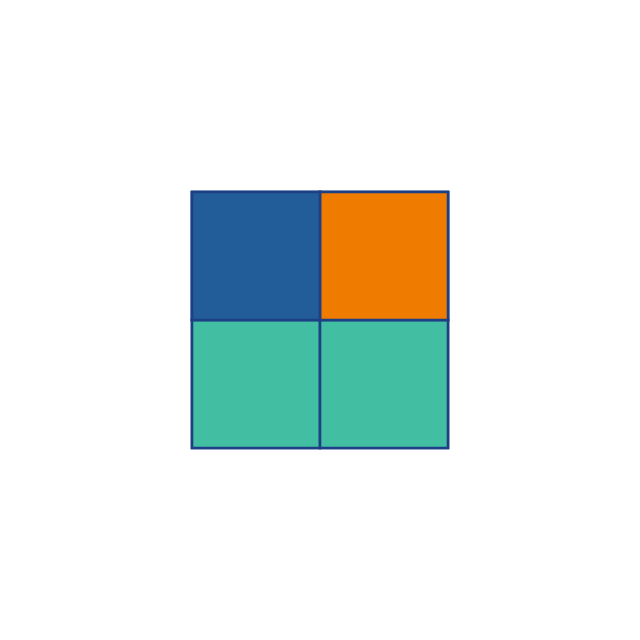

<!--
**KaiqueJuvencio/KaiqueJuvencio** is a ✨ _special_ ✨ repository because its `README.md` (this file) appears on your GitHub profile.

Here are some ideas to get you started:

- 🔭 I’m currently working on ...
- 🌱 I’m currently learning ...
- 👯 I’m looking to collaborate on ...
- 🤔 I’m looking for help with ...
- 💬 Ask me about ...
- 📫 How to reach me: ...
- 😄 Pronouns: ...
- ⚡ Fun fact: ...
-->

<h2> Hey, I'm Kaique Costa!  </h2>

<!--  -->

:rocket: I'm A Software Developer, that has been working as a Back-End developer since January 2019.

:dart: I'm passionate about solving problems and learning. Always open to new challenges and ready to face changes.

> - 📍 From SP - Brazil
> - 💻 Junior Java Developer at [Della Volpe Transportes](https://dellavolpe.com.br/)
> - :mortar_board: Bachelor's degree, Computer Science at [Mackenzie](https://www.mackenzie.br/) (12/2021)
> - :books: [Look at my CV](http://kaiquecosta.com/cv/KaiqueCV.pdf)
> - 🌍 [Kaique's Portfolio](http://www.kaiquecosta.com)

Reach me out 👇🏼

<h2>Stats</h2>

  

